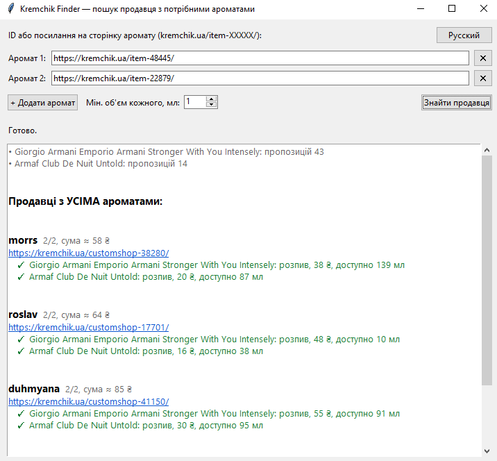

# Kremchik Finder

🇷🇺 [Русский](#русский) · 🇺🇦 [Українська](#українська)



---

## Русский

Маленькое десктопное приложение, которое ищет на [kremchik.ua](https://kremchik.ua) **одного продавца, у которого есть сразу все нужные ароматы**, чтобы платить за одну доставку вместо нескольких.

### Возможности

- Поиск по нескольким ароматам: вставь ID или ссылку вида `kremchik.ua/item-XXXXX/`
- Показывает продавцов со **всеми** ароматами; если таких нет, лучшие частичные варианты
- Учитывает минимальный нужный объём каждого аромата
- Для каждого продавца показывает тип предложения (распив / остаток во флаконе), цену и доступный объём
- Интерфейс на русском и украинском, язык переключается кнопкой в углу окна

### Скачать

Готовый `KremchikFinder.exe` для Windows лежит в разделе [Releases](../../releases/latest). Python не нужен.

> Windows или антивирус может предупредить о неизвестном издателе. Это обычное дело для exe, собранных PyInstaller. Исходный код открыт, можно собрать самому.

### Запуск из исходников

```bash
pip install -r requirements.txt
python kremchik_gui.py
```

### Сборка exe

```bash
pip install pyinstaller
pyinstaller --onefile --windowed --name KremchikFinder kremchik_gui.py
```

Результат: `dist/KremchikFinder.exe`.

### Как это работает

Приложение загружает страницу каждого аромата (`/item-XXXXX/`), разбирает список предложений и группирует их по продавцам. Между запросами стоит пауза 1,5 секунды, чтобы не нагружать сайт.

Парсер опирается на текущую разметку и русские подписи сайта («купить на витрине», «свободно N мл», «остаток во флаконе»). Если сайт изменит вёрстку, парсер придётся обновить.

### Дисклеймер

Неофициальный личный инструмент, не связан с kremchik.ua. Используй с умом и соблюдай правила сайта.

---

## Українська

Невеликий десктопний застосунок, який шукає на [kremchik.ua](https://kremchik.ua) **одного продавця, у якого є одразу всі потрібні аромати**, щоб платити за одну доставку замість кількох.

### Можливості

- Пошук за кількома ароматами: встав ID або посилання виду `kremchik.ua/item-XXXXX/`
- Показує продавців з **усіма** ароматами; якщо таких немає, найкращі часткові варіанти
- Враховує мінімальний потрібний об'єм кожного аромату
- Для кожного продавця показує тип пропозиції (розпив / залишок у флаконі), ціну та доступний об'єм
- Інтерфейс російською та українською, мова перемикається кнопкою в куті вікна

### Завантажити

Готовий `KremchikFinder.exe` для Windows лежить у розділі [Releases](../../releases/latest). Python не потрібен.

> Windows або антивірус може попередити про невідомого видавця. Це звичайна річ для exe, зібраних PyInstaller. Вихідний код відкритий, можна зібрати самому.

### Запуск із вихідного коду

```bash
pip install -r requirements.txt
python kremchik_gui.py
```

### Збірка exe

```bash
pip install pyinstaller
pyinstaller --onefile --windowed --name KremchikFinder kremchik_gui.py
```

Результат: `dist/KremchikFinder.exe`.

### Як це працює

Застосунок завантажує сторінку кожного аромату (`/item-XXXXX/`), розбирає список пропозицій і групує їх за продавцями. Між запитами є пауза 1,5 секунди, щоб не навантажувати сайт.

Парсер спирається на поточну розмітку та російські підписи сайту («купить на витрине», «свободно N мл», «остаток во флаконе»). Якщо сайт змінить верстку, парсер доведеться оновити.

### Застереження

Неофіційний особистий інструмент, не пов'язаний з kremchik.ua. Користуйся розумно та дотримуйся правил сайту.
